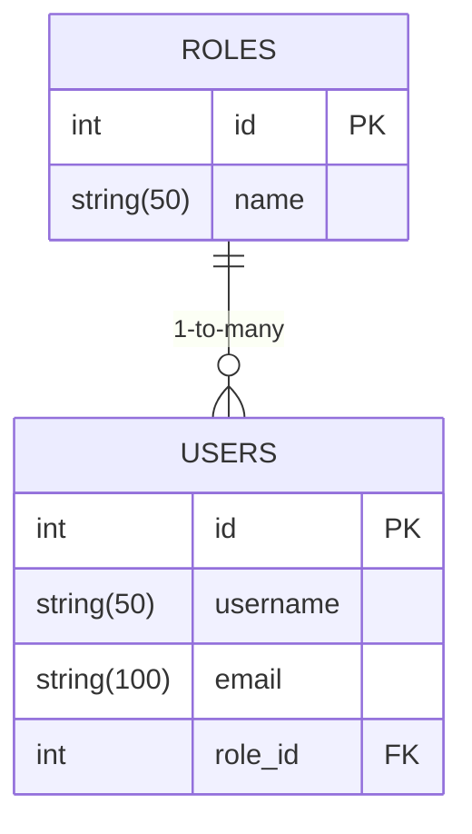

# IAM (Identity and Access Management) System Documentation

## Overview

The IAM (Identity and Access Management) system is a FastAPI-based service that provides user and role management functionality. It includes features for authentication, authorization, and user management with support for caching, messaging, and resilience patterns.

## Table of Contents

1. [Project Structure](#project-structure)
2. [Getting Started](#getting-started)
   - [Prerequisites](#prerequisites)
   - [Installation](#installation)
   - [Running Locally](#running-locally)
3. [API Documentation](#api-documentation)
   - [Roles](#roles)
   - [Users](#users)
4. [Architecture](#architecture)
   - [Core Components](#core-components)
   - [Database Schema](#database-schema)
5. [Deployment](#deployment)
   - [Docker](#docker)
   - [Kubernetes](#kubernetes)
6. [Testing](#testing)
7. [Monitoring](#monitoring)
8. [Contributing](#contributing)

## Project Structure

```
sbolife-iam/
├── README.md
├── __init__.py
├── alembic.ini
├── docker-compose.yml
├── Dockerfile
├── entrypoint.sh
├── kind-config.yml
├── LICENSE
├── pyproject.toml
├── requirements.txt
├── alembic/
│   ├── __init__.py
│   ├── env.py
│   ├── README
│   ├── script.py.mako
│   └── versions/
│       └── 167c8a0dd4ae_initial_migration.py
├── certs/
│   ├── tls.crt
│   └── tls.key
├── iam/
│   ├── __init__.py
│   ├── main.py
│   ├── api/
│   │   ├── __init__.py
│   │   └── v1/
│   │       ├── __init__.py
│   │       └── endpoints/
│   │           ├── __init__.py
│   │           ├── role.py
│   │           └── user.py
│   ├── core/
│   │   ├── __init__.py
│   │   ├── cache.py
│   │   ├── config.py
│   │   ├── messaging.py
│   │   └── resilience.py
│   ├── crud/
│   │   ├── __init__.py
│   │   ├── role.py
│   │   └── user.py
│   ├── db/
│   │   ├── __init__.py
│   │   ├── base.py
│   │   └── session.py
│   ├── models/
│   │   ├── __init__.py
│   │   ├── role.py
│   │   └── user.py
│   └── schemas/
│       ├── __init__.py
│       ├── role.py
│       └── user.py
├── k8s/
│   ├── deployment.yml
│   ├── ingress.yml
│   ├── monitor.yml
│   ├── rabbitMQ.yml
│   ├── redis.yml
│   └── service.yml
├── tests/
│   ├── __init__.py
│   ├── test_api.py
│   ├── test_cache.py
│   ├── test_crud.py
│   ├── test_metrics.py
│   ├── test_resilience.py
│   └── test_role.py
└── .github/
    └── workflows/
        └── ci.yml
```

## Getting Started

### Prerequisites

- Python 3.11+
- Docker
- Docker Compose
- Redis
- RabbitMQ

### Installation

```bash
# Clone the repository
git clone https://github.com/sbolife/iam.git
cd iam

# Install dependencies
pip install -r requirements.txt
```

### Running Locally

```bash
# Start services using Docker Compose
docker-compose up -d

# Run migrations
alembic upgrade head

# Start the application
uvicorn iam.main:app --reload
```

The application will be available at `http://localhost:8000`

## API Documentation

### Roles

#### Create a Role
```
POST /api/v1/roles/
```

Request Body:
```json
{
  "name": "admin"
}
```

Response:
```json
{
  "name": "admin",
  "id": 1
}
```

#### List Roles
```
GET /api/v1/roles/
```

Response:
```json
[
  {
    "name": "admin",
    "id": 1
  }
]
```

### Users

#### Create a User
```
POST /api/v1/users/
```

Request Body:
```json
{
  "username": "john_doe",
  "email": "john@example.com",
  "role_id": 1
}
```

Response:
```json
{
  "username": "john_doe",
  "email": "john@example.com",
  "role_id": 1,
  "id": 1,
  "role": {
    "name": "admin",
    "id": 1
  }
}
```

#### Get User by ID
```
GET /api/v1/users/{user_id}
```

Response:
```json
{
  "user": {
    "id": 1,
    "username": "john_doe"
  }
}
```

## Architecture

### Core Components

1. **FastAPI**: Web framework for building APIs
2. **SQLAlchemy**: ORM for database interactions
3. **Redis**: Caching layer
4. **RabbitMQ**: Message broker for async communication
5. **Alembic**: Database migration tool
6. **Prometheus**: Metrics collection

### Database Schema



## Deployment

### Docker

Build the Docker image:
```bash
docker build -t iam:latest .
```

Run with Docker Compose:
```bash
docker-compose up -d
```

### Kubernetes

Deploy to Kubernetes:
```bash
kubectl apply -f k8s/
```

## Testing

Run tests:
```bash
PYTHONPATH=. pytest tests/
```

## Monitoring

Metrics are available at:
```
GET /metrics
```

Prometheus metrics include:
- `request_count`: Total HTTP requests
- `request_time_seconds`: Request processing time

## Contributing

1. Fork the repository
2. Create a new branch
3. Commit your changes
4. Push to the branch
5. Create a Pull Request

---

## Markdown Files

Here are the markdown files you should create for your project documentation:

### README.md

```markdown
# IAM (Identity and Access Management) System

[](https://github.com/sbolife/iam/actions/workflows/ci.yml)

A FastAPI-based Identity and Access Management system with user and role management capabilities.

## Features

- User management (create, retrieve)
- Role management
- Redis caching
- RabbitMQ messaging
- Prometheus metrics
- Circuit breaker and retry patterns

## Quick Start

```bash
# Start services
docker-compose up -d

# Run migrations
alembic upgrade head

# Start the application
uvicorn iam.main:app --reload
```

The API will be available at `http://localhost:8000`

## Documentation

For full documentation, see [DOCUMENTATION.md](DOCUMENTATION.md)

## License

Apache 2.0
```

### DOCUMENTATION.md

```markdown
# IAM System Documentation

[Full documentation content as shown above]
```

### DEVELOPMENT.md

```markdown
# Development Guide

## Setup Development Environment

1. Install Python 3.11+
2. Install dependencies:
   ```bash
   pip install -r requirements.txt
   ```
3. Set up pre-commit hooks:
   ```bash
   pre-commit install
   ```

## Code Style

- Follow PEP 8 guidelines
- Use type hints for all functions
- Keep functions small and focused
- Write docstrings for all public methods

## Testing

Run tests:
```bash
PYTHONPATH=. pytest tests/
```

## Database Migrations

Create a new migration:
```bash
alembic revision --autogenerate -m "description"
```

Apply migrations:
```bash
alembic upgrade head
```

## CI/CD

The CI pipeline runs on every push to main branch and:
1. Installs dependencies
2. Runs tests
3. Builds Docker image
```

### API_REFERENCE.md

```markdown
# API Reference

## Base URL
`http://localhost:8000/api/v1`

## Authentication
[Describe authentication when implemented]

## Endpoints

### Roles

#### Create Role
`POST /roles/`

**Request:**
```json
{
  "name": "admin"
}
```

**Response:**
```json
{
  "id": 1,
  "name": "admin"
}
```

### Users

#### Create User
`POST /users/`

**Request:**
```json
{
  "username": "testuser",
  "email": "user@example.com",
  "role_id": 1
}
```

**Response:**
```json
{
  "id": 1,
  "username": "testuser",
  "email": "user@example.com",
  "role_id": 1,
  "role": {
    "id": 1,
    "name": "admin"
  }
}
```

[Include all other endpoints]
```

### DEPLOYMENT.md

```markdown
# Deployment Guide

## Docker

### Build
```bash
docker build -t iam:latest .
```

### Run
```bash
docker-compose up -d
```

## Kubernetes

### Prerequisites
- Kubernetes cluster
- kubectl configured
- Helm (optional)

### Deploy
```bash
kubectl apply -f k8s/
```

### Verify
```bash
kubectl get pods
kubectl get services
```

## Configuration

Environment variables:
- `DATABASE_URL`: Database connection string
- `REDIS_URL`: Redis connection URL
- `RABBITMQ_URL`: RabbitMQ connection URL
```

These markdown files provide comprehensive documentation for your IAM system, covering all aspects from development to deployment.